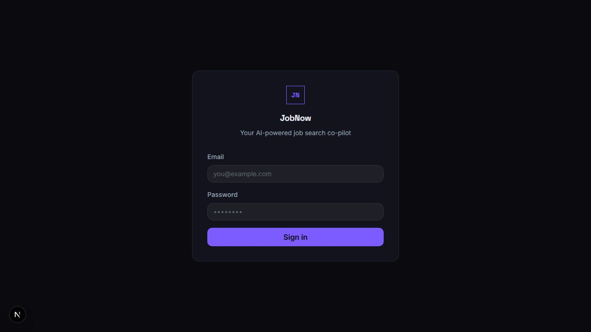

# JobNow

AI job-search copilot that turns scattered application work into one workflow: track recruiter email, draft professional posts, discover openings, and tailor resumes.

[Live demo](https://jobnow-lime.vercel.app) · [Portfolio](https://joao-vitor-barros-da-silva-portfoli.vercel.app)



## What it demonstrates

- End-to-end product development with Next.js 16, React 19, TypeScript, and Supabase
- LLM-backed classification and writing workflows using Anthropic Claude
- Google integrations across Gmail, Calendar, and Sheets
- Server-side aggregation of job and technology-news APIs
- Resume generation as structured LaTeX rather than unformatted AI text

## Product modules

| Route | Workflow |
| --- | --- |
| `/tracker` | Import recruiter email, classify it, create calendar reminders, and update an application tracker |
| `/posts` | Turn current technology news into three editable LinkedIn post drafts |
| `/jobs` | Search openings and generate a role-specific LaTeX resume |

## Stack

- Next.js 16 App Router, React 19, TypeScript, Tailwind CSS 4
- Supabase Postgres and authentication
- Anthropic SDK
- Gmail, Google Sheets, Google Calendar, NewsAPI, CryptoPanic, Indeed, and ZipRecruiter APIs

## Run locally

Requirements: Node.js 20+ and pnpm.

```bash
pnpm install
cp .env.example .env.local
pnpm dev
```

Open <http://localhost:3000>. Add only the integrations you want to exercise to `.env.local`; never commit API keys or OAuth secrets.

## Production check

```bash
pnpm build
pnpm start
```

The public deployment is a portfolio demo. External workflows require valid provider credentials and may be limited by third-party API quotas.
